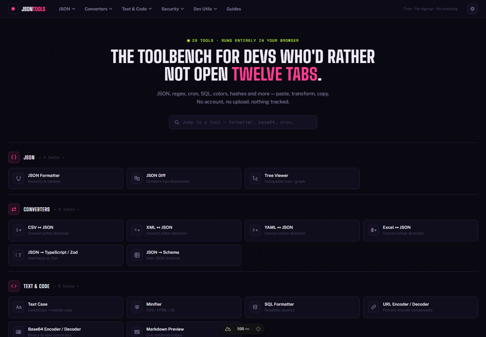

# JSON Tools

**[jsontools.space](https://jsontools.space)** — 30 free developer tools in one static site. No signup, no upload, nothing tracked: every tool runs entirely in the browser, and no input ever touches a server.



## What it is

JSON Tools is a toolbench for the small, repetitive jobs developers reach for constantly — formatting JSON, converting between data formats, decoding a JWT, testing a regex — without opening a dozen different sites or trusting a random one with real data. Every tool is client-side only (parsing, formatting, hashing, encoding all happen in the tab), and the site ships as a fully static build with no backend or database.

It also includes 24 reference guides (`/guides`) covering the concepts behind the tools — JSON, YAML, Base64, hashing, JWTs, regex, cron syntax, and more.

## The 30 tools

**JSON**
JSON Formatter & Validator · JSON Diff · Tree / Graph Viewer

**Converters**
CSV ↔ JSON · XML ↔ JSON · YAML ↔ JSON · Excel ↔ JSON · JSON → TypeScript / Zod · JSON → Schema

**Text & Code**
Text Case Converter · CSS/HTML/JS Minifier · SQL Formatter · URL Encoder / Decoder · Base64 Encoder / Decoder · Markdown Preview

**Security**
JWT Decoder · JWT Generator · Hash Generator (MD5/SHA-1/SHA-256…) · UUID Generator · Password Generator

**Dev Utils**
Regex Tester · Cron Parser · Unix Timestamp Converter · Number Base Converter · Color Picker (HEX/RGB/HSL + contrast) · CSS Gradient Generator

## Stack

- **Nuxt 4 / Vue 3 / TypeScript**, built as a pure static site (`nuxt generate`) — no server runtime, deployed on Vercel
- **CodeMirror 6** for syntax-highlighted editors, **Vue Flow** + **dagre** for the JSON graph view
- **@nuxt/fonts** — Google Fonts self-hosted and bundled at build time, no third-party font requests at runtime
- Format-specific libraries: `js-yaml`, `papaparse`, `xlsx`, `fast-xml-parser`, `sql-formatter`, `marked`, `jspdf`, `html-to-image`, `dompurify`, `html-minifier-terser`, `lightningcss-wasm`
- **Vitest** + `@vue/test-utils` for unit tests (251 tests across composables), **Playwright** for scripted checks
- Plain scoped CSS + one global stylesheet — no CSS utility framework

## Architecture

```
app/
├─ pages/
│  ├─ tools/*.vue        # 29 tool pages — thin UI layer per tool
│  ├─ guides/[slug].vue  # single dynamic page rendering all 24 guides
│  └─ index.vue          # homepage (tool catalog + search)
├─ composables/          # business logic per tool (parsing, formatting,
│                        # generating) — framework-light, unit tested
├─ components/
│  ├─ guides/body/*.vue  # long-form content for each guide
│  └─ *.vue              # shared UI: JsonEditor, StatusBar, SeoSection,
│                        # ToolSwitch, FaqAccordion, AdSlot...
├─ data/
│  ├─ tools.ts           # single source of truth for the 29 tools —
│  │                     # nav, footer, homepage and sitemap all derive from it
│  └─ guides.ts          # same pattern for the 24 guides
├─ utils/                # small stateless helpers (safeJsonParse, triggerDownload...)
└─ workers/
   └─ excel.worker.ts    # sandboxes xlsx/SheetJS (known CVEs) off the main thread

server/routes/sitemap.xml.ts  # sitemap generated from tools.ts + guides.ts,
                               # prerendered at build time (no separate module)
tests/                         # Vitest unit tests, one file per composable
```

Tool pairs that convert in both directions (e.g. `csv-to-json` / `json-to-csv`) are two independent, fully indexable routes under the hood, but only one is shown per pair in navigation — the other is reachable via the in-page direction-swap control and stays in the sitemap.

## Getting started

```bash
npm install
npm run dev       # http://localhost:3000
npm run build     # nuxt generate — static output in .output/public
npm run test      # Vitest
```

## License

[MIT](LICENSE)
